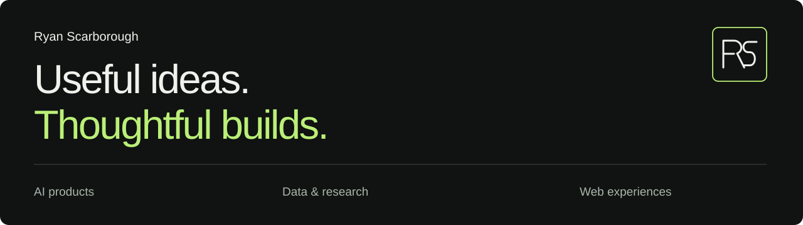

# Hi, I’m Ryan Scarborough.

I connect business thinking with AI, analytics, and thoughtful design to make complex things easier to use. My work spans useful AI products, reproducible research, and websites with a clear purpose.

[LinkedIn](https://www.linkedin.com/in/ryanscarborough) · [GitHub](https://github.com/lionatzion)

## Selected work

These are websites I designed. The links lead to their current public sites.

| Project | Focus |
| --- | --- |
| [AI Analysis](https://ai-analysis.ai/) | AI model comparison, pricing, benchmarks, and tools. Includes third-party data from [Artificial Analysis](https://artificialanalysis.ai/). |
| [Women’s Wellness Spa(ce)](https://www.wwsphilly.org/) | A welcoming website for a Philadelphia nonprofit. |
| [Accordant](https://ai-explanation.com/) | Website design and a prelaunch product preview for managed AI voice operations. Currently hosted at ai-explanation.com. |
| [Apex Aerial Services](https://apexaerialservices.com/) | A visual-first website for drone and photography services. |

More website design: [Private Money Advisors](https://privatemoneyadvisors.com/) · [RS Commercial Services](https://rscommercialservices.com/)

## Curiosity, made reproducible

- **[Pursuit of Alpha](https://github.com/lionatzion/PursuitofAlpha)** — Model training and strategy backtesting, built as a research and education workflow.
- **[KryptosCipher](https://github.com/lionatzion/KryptosCipher)** — A reproducible investigation into the Kryptos K4 cipher, with scripts, notebooks, and candidate exports.

## Business perspective. Technical curiosity.

I’m bringing a business background into the work of building useful AI products, analytics, and automation. I care about understanding the problem as much as making the solution.

Currently studying **MS Data Analytics Engineering at Northeastern University** — in progress.

Personal portfolio: local preview in review; public link pending publication.

**[Let’s connect on LinkedIn →](https://www.linkedin.com/in/ryanscarborough)**
